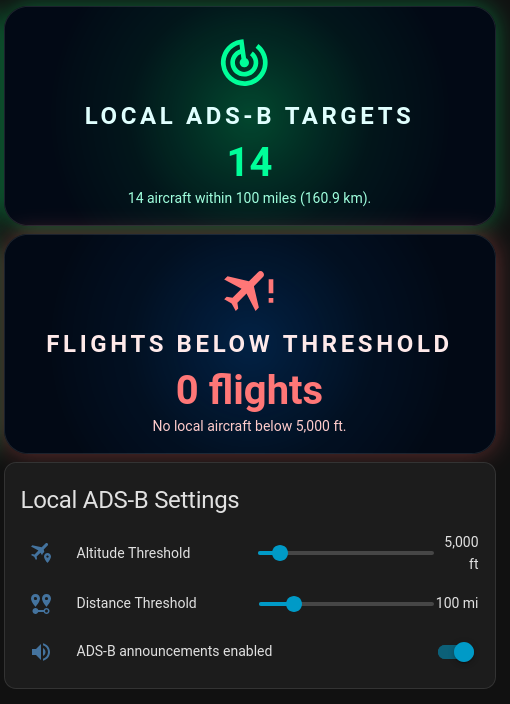

# ADS-B Local Flight Tracking for Home Assistant

```markdown


```

Track and announce aircraft flying near your home using your local ADS-B receiver (tar1090) with Home Assistant.



## Features

- 📡 **Real-time aircraft tracking** from your local ADS-B receiver (tar1090)
- 🔊 **Voice announcements** of aircraft callsigns and altitudes using Piper TTS
- 📏 **Distance filtering** (0-500 miles / 0-804 km radius)
- ✈️ **Altitude filtering** to track only low-flying aircraft
- 🎨 **Beautiful dashboard cards** with animated radar icons
- 🏠 **Location-aware** announcements (only when you're home)
- 🔄 **Automatic updates** every 5 seconds from your ADS-B feed
- 🎯 **Smart cooldown** to prevent repeated announcements of the same aircraft

## Screenshots

### Dashboard Cards

*Real-time aircraft count with distance and altitude filtering*


*Easy-to-use sliders for altitude and distance thresholds*

## Prerequisites

- **Home Assistant** (tested on Core 2025.11.3, OS 16.3)
- **Local ADS-B receiver** running tar1090 (e.g., ADS-B Exchange, readsb, dump1090)
- **Custom Button Card** integration ([HACS](https://github.com/custom-cards/button-card))
- **Piper TTS** for voice announcements (optional, can substitute another TTS)
- **Media players** configured for announcements

## Quick Start

1. **Install prerequisites** (see [Installation Guide](docs/INSTALLATION.md))
2. **Add REST sensor** to pull data from your tar1090 server
3. **Create template sensors** to process aircraft data
4. **Set up helpers** for configuration options
5. **Add automation** for voice announcements
6. **Add dashboard cards** for visualization

**Detailed installation instructions:** [docs/INSTALLATION.md](docs/INSTALLATION.md)

## Configuration

### Key Settings

- **Altitude Threshold**: Only announce aircraft below this altitude (default: 15,000 ft)
- **Distance Threshold**: Only announce aircraft within this radius (default: 50 miles / 80 km)
- **Announcements Toggle**: Enable/disable voice announcements
- **Device Tracker**: Configure your presence detection device

### Customization

Edit these values in the automation variables:
```yaml
variables:
  max_alt: 15000  # Maximum altitude in feet
  max_distance_miles: 50  # Maximum distance in miles
```

Edit the REST sensor URL to point to your tar1090 server:
```yaml
resource: http://YOUR_ADSB_SERVER_IP/tar1090/data/aircraft.json
```

## How It Works

1. **REST Sensor** polls your local tar1090 server every 5 seconds for aircraft data
2. **Template Sensors** clean and process the raw JSON data
3. **Dashboard Cards** calculate real-time distance using Haversine formula and display filtered counts
4. **Automation** checks aircraft against altitude/distance thresholds and announces new aircraft
5. **Cooldown Logic** prevents repeat announcements of the same aircraft

## Troubleshooting

- **No aircraft showing?** Check your tar1090 URL is accessible: `http://YOUR_IP/tar1090/data/aircraft.json`
- **Sensor showing 0 aircraft?** Verify REST sensor is pulling data in Developer Tools → States
- **No announcements?** Check that toggle is ON, you're home, and threshold is reasonable
- **Cards not updating?** Clear browser cache and verify custom:button-card is installed

**Full troubleshooting guide:** [docs/TROUBLESHOOTING.md](docs/TROUBLESHOOTING.md)

## File Structure

```
├── configuration/
│   ├── rest_sensor.yaml          # REST sensor to pull tar1090 data
│   ├── template_sensors.yaml     # Template sensors for processing
│   └── automation.yaml            # Announcement automation
├── lovelace/
│   └── adsb_dashboard_card.yaml  # Dashboard cards
├── helpers/
│   └── required_helpers.md       # Instructions to create helpers
└── docs/
    ├── INSTALLATION.md            # Step-by-step installation
    ├── TROUBLESHOOTING.md         # Common issues and solutions
    └── screenshots/               # Screenshot images
```

## Hardware Setup

This integration works with any ADS-B receiver running tar1090, including:

- **ADS-B Exchange** setup (recommended - what I use)
- **readsb-protobuf** with tar1090
- **dump1090-fa** with tar1090 web interface
- **Raspberry Pi** or any Linux system running ADS-B software

Example hardware:
- Raspberry Pi 5 (or 4, 3, Zero 2 W)
- RTL-SDR dongle (RTL2832U)
- 1090 MHz antenna
- Location with clear sky view

## Contributing

Contributions welcome! Feel free to:
- Open issues for bugs or feature requests
- Submit pull requests with improvements
- Share your modifications and enhancements

## Acknowledgments

- Built for Home Assistant community
- Uses data from local tar1090 ADS-B receiver
- Inspired by aircraft tracking enthusiasts worldwide

## License

MIT License - see [LICENSE](LICENSE) for details

## Support

- **Issues**: [GitHub Issues](https://github.com/redneckzking/ADS-B-Local-Flight-Tracking-HA-Integration/issues)
- **Discussions**: [GitHub Discussions](https://github.com/redneckzking/ADS-B-Local-Flight-Tracking-HA-Integration/discussions)
- **Home Assistant Community**: Share your setup!

## Changelog

See [CHANGELOG.md](CHANGELOG.md) for version history and updates.

---

**Note**: This integration tracks aircraft using publicly available ADS-B data from your own receiver. Ensure compliance with local regulations regarding ADS-B reception and data usage.
